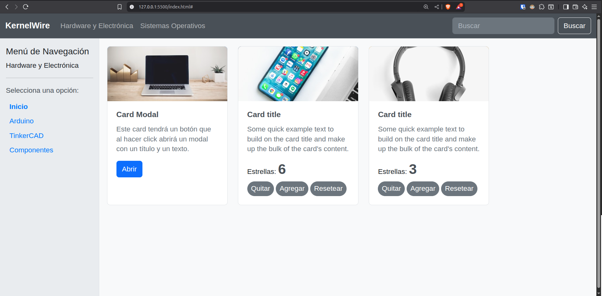
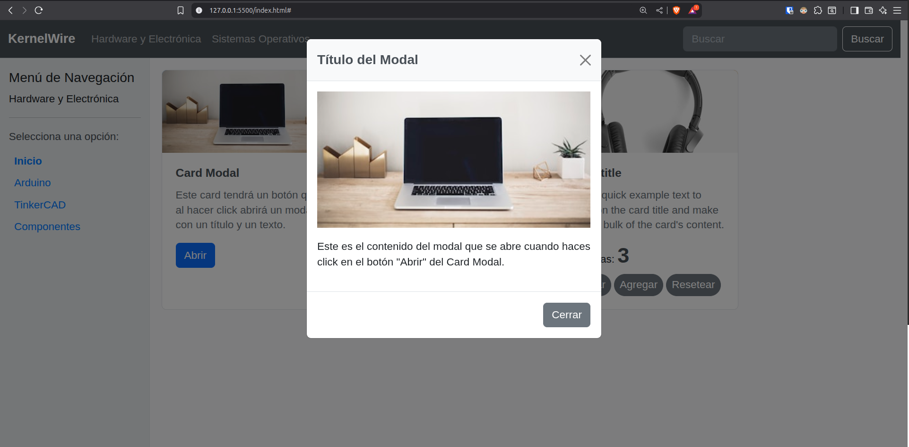

# Parcial 2 – DPW107

**Fecha:** 12/07/2025
**Estudiante:** Marshel Aillón Cardozo

## Descripción del sitio web desarrollado

Este proyecto es un sitio web que combina elementos de Bootstrap con componentes dinámicos personalizados en JavaScript. El sitio incluye:

- Un **navbar** con enlaces a categorías principales y un campo de búsqueda.
- Un **sidebar** con el título de la sección principal y submenús.
- Un **contenido principal** con al menos 3 cards, cada una con un título, imagen, descripción breve y un botón que abre un modal.
- **Contadores dinámicos** implementados en las cards, con funciones para incrementar, decrementar y reiniciar, que funcionan de manera independiente pero reutilizando el mismo código JavaScript.

## Capturas de pantalla

### Parte 1: Interfaz principal con Bootstrap
  

### Parte 2: Componentes dinámicos con JS
  
